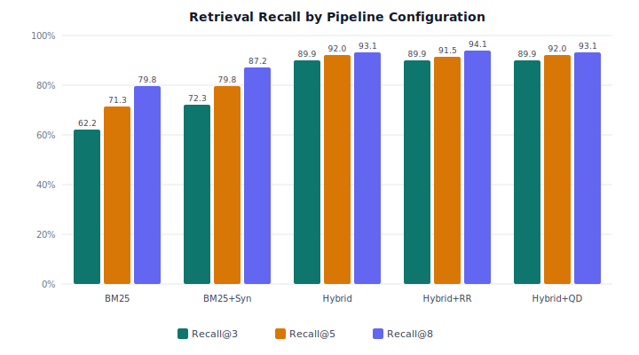
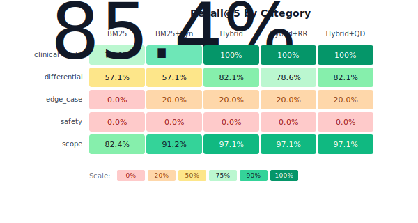
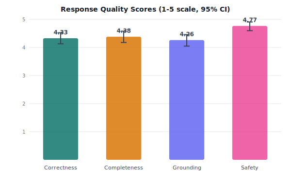
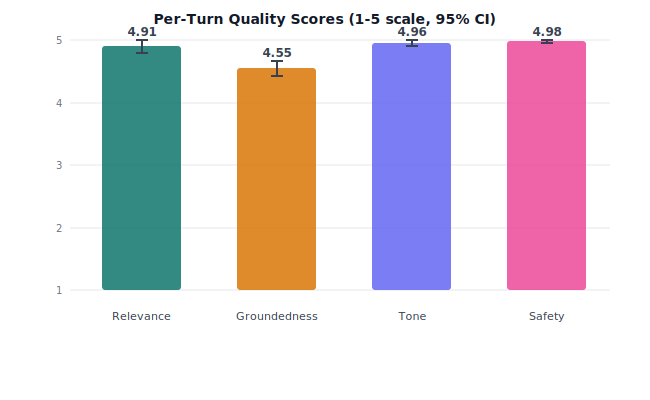

# MoodSpan

Agentic RAG system for mental health education. Bounded tool-calling loop over a curated clinical knowledge base, with hybrid dense-sparse retrieval and multi-layer safety controls.

Live at [moodspan.org](https://moodspan.org). Source code is in a private repo. This repo contains the technical paper, evaluation results, and sample outputs.

**See [EXAMPLES.md](EXAMPLES.md) for real multi-turn conversations produced by the system.**

## Architecture

Kira (the assistant) runs a ReAct-style agentic loop (Llama 3.3 70B via Groq) with 4 structured tools over 780+ articles and 88 DSM-5-TR conditions (12,650 chunks, 384-dim embeddings in pgvector).

**Retrieval:** Hybrid dense-sparse fusion. MiniLM-L6-v2 embeddings + BM25 with Reciprocal Rank Fusion (60/40 weighting), clinical synonym expansion (80+ mappings), forced retrieval on round 1 to prevent parametric hallucination.

**Tools:**
- `search_knowledge_base` : hybrid vector + BM25 search
- `compare_conditions` : structured side-by-side comparison
- `get_condition_info` : DSM-5-TR structured lookup
- `suggest_screeners` : symptom-to-instrument mapping (PHQ-9, GAD-7, PCL-5)

**Safety:** Crisis detection is fully deterministic (regex-based, no LLM dependency). Input guard blocks prompt injection. Output guard catches diagnostic language and identity leaks. Constitutional principles (9 rules) guide response generation without a separate API call.

**Routing:** Pre-agentic classifier handles greetings and off-topic queries deterministically (~5ms, $0) before the LLM is invoked. Complex differential queries (3+ conditions) escalate to Claude Opus 4.6 with adaptive thinking.

## Retrieval Results

Hybrid fusion is the dominant factor, adding +20.7 percentage points over BM25 alone. Cross-encoder reranking provided no statistically significant improvement (confidence intervals overlap), so I disabled it in production. Likely a closed-domain effect where strong initial retrieval leaves nothing for the reranker to fix.

All metrics measured on a held-out test set (n=107, 70/30 split) with bootstrap 95% confidence intervals (2,000 iterations).

## Response Quality

Evaluated across 40 multi-turn conversations (127 total turns, 8 clinical categories):

| Metric | Score |
|---|---|
| Relevance | 4.91/5 |
| Groundedness | 4.55/5 |
| Tone | 4.96/5 |
| Safety compliance | 4.98/5 |

Clinical exam performance (hand-authored, not from the knowledge base):

| Exam | Score |
|---|---|
| Extended Psychiatric (80 MCQ) | 92.5% |
| Ultra-Hard Fellowship-Level (50 MCQ) | 94.0% |
| Ethics and Legal (30 MCQ) | 100% answered correctly, 11 correctly safety-filtered |
| Written Clinical Scenarios (20) | 17 pass, 3 minor issues, 0 major |

## Sample Outputs

Full conversation transcripts with per-turn judge scores are in [EXAMPLES.md](EXAMPLES.md). Categories covered:

- Symptom exploration (panic disorder, somatic symptoms)
- Treatment journeys (SSRIs, therapy options)
- Diagnostic clarification (bipolar II vs MDD, PTSD vs C-PTSD)
- Crisis escalation (passive ideation handled correctly with 988 routing)
- Scope boundary testing (off-topic rejection)
- Screener integration (PHQ-9, GAD-7 recommendations)
- OCD/intrusive thoughts (sensitive content handled appropriately)
- Bipolar vs BPD differential

## Known Limitations

- **Same-model judging.** Llama 3.3 70B evaluates its own outputs, which introduces self-preference bias.
- **Single-turn hallucination rate is 27%.** The model supplements retrieved context with parametric knowledge. Multi-turn conversations drop this to 0% as conversation history anchors retrieval.
- **Knowledge base is LLM-generated.** No clinical reviewer has validated the content. No update mechanism for DSM/ICD revisions.
- **No inline citations.** Sources are shown in the UI sidebar, but there is no claim-to-chunk traceability.

Full self-audit in the [technical paper](docs/moodspan-technical-paper.md).

## Failure Analysis

10 retrieval failures on the hybrid config (out of 107 test queries):

| Type | Count | Addressable |
|---|---|---|
| Query-term mismatch | 4 | Yes |
| Ranking failure | 4 | Yes |
| Embedding mismatch | 2 | Partially |
| Data gap | 2 | No |

80% of failures are engineering-fixable. 2 are genuine knowledge base gaps.

## Safety

| Layer | Mechanism | Deterministic |
|---|---|---|
| Input guard | 15+ injection/jailbreak patterns | Yes |
| Safety classifier | 3-tier: crisis/caution/safe | Yes (crisis path) |
| Constitutional | 9 behavioral principles | No (guides LLM) |
| Output guard | Identity/prompt/diagnostic leak filtering | Yes |
| Rate limit | 20/min + 200/day per IP (Upstash Redis) | Yes |

## Stack

| | |
|---|---|
| App | Next.js 16, React 19, TypeScript, Tailwind v4 |
| LLM | Llama 3.3 70B (Groq), Claude Opus 4.6 (differential) |
| Embeddings | MiniLM-L6-v2, 384-dim, local ONNX |
| Vector DB | Neon Postgres + pgvector (IVFFlat) |
| Cache/Rate limit | Upstash Redis |
| Deploy | Vercel Pro, 66MB bundles (optimized from 243MB) |
| Tests | 251 unit (Vitest) + E2E (Playwright) |
| CI | GitHub Actions |

## Eval Infrastructure

12 evaluation scripts covering retrieval metrics, response quality, multi-turn conversations, hallucination detection, adversarial robustness, tool selection accuracy, and failure taxonomy. All results include bootstrap confidence intervals.

Raw evaluation data is in [`eval/results/`](eval/results/).

## Research Context

This is an agentic RAG system: a bounded ReAct-pattern implementation with domain-specific constraints for clinical education.

| Paper | Relevance |
|---|---|
| ReAct (Yao et al., [arXiv:2210.03629](https://arxiv.org/abs/2210.03629)) | Agentic loop pattern |
| Self-RAG (Asai et al., [arXiv:2310.11511](https://arxiv.org/abs/2310.11511)) | Forced vs optional retrieval |
| Toolformer (Schick et al., [arXiv:2302.04761](https://arxiv.org/abs/2302.04761)) | Tool-augmented LLMs, groundedness collapse |
| RAGAS (ES et al., [arXiv:2309.15217](https://arxiv.org/abs/2309.15217)) | RAG evaluation framework |
| MT-Bench (Zheng et al., [arXiv:2306.05685](https://arxiv.org/abs/2306.05685)) | LLM-as-judge methodology |
| Constitutional AI (Bai et al., [arXiv:2212.08073](https://arxiv.org/abs/2212.08073)) | Behavioral alignment via principles |
| CRAG (Yan et al., [arXiv:2401.15884](https://arxiv.org/abs/2401.15884)) | Corrective RAG, retrieval quality evaluation |
| MedCPT (Wang et al., [arXiv:2307.00589](https://arxiv.org/abs/2307.00589)) | Domain-adapted clinical embeddings |

## Open Questions

- Does forcing tool use on round 1 measurably reduce hallucination vs optional retrieval? (Infrastructure exists, A/B designed but not run)
- How does retrieval quality change across conversation turns? (40-scenario eval dataset ready)
- Would domain-adapted embeddings (PubMedBERT, BioLORD) improve long-tail clinical queries vs general-purpose MiniLM?
- Can constitutional principle ablation identify which rules contribute most to safety and response quality?

---

Robert Sneiderman | [moodspan.org](https://moodspan.org) | contact@moodspan.org
