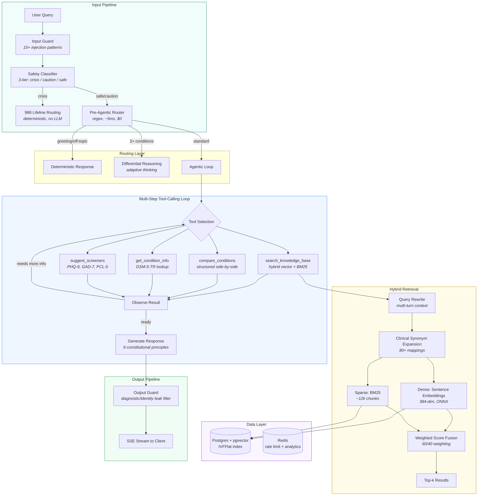

# MoodSpan

Hybrid-search clinical QA system with an agentic 4-tool reasoning loop, ablation-tested retrieval pipeline, and structured diagnostic reasoning. 793 articles, 88 DSM-5-TR disorders, 596 tests, 438-query eval suite with bootstrap confidence intervals. 92% internal Recall@5, 26% on external MHQA-Gold — both numbers shown honestly.

Live at [moodspan.org](https://moodspan.org). Architecture walkthrough at [/research](https://moodspan.org/research). Live demo replay at [/showcase](https://moodspan.org/showcase).

**[Multi-turn conversation examples](EXAMPLES.md)** | **[Technical paper](docs/moodspan-technical-paper.md)** | **[Raw eval data](eval/results/)** | **[18-question self-audit](docs/audit/round2-answers.md)**

> **Disclaimer:** MoodSpan is an independent research project exploring retrieval-augmented generation, hybrid search, and agentic tool orchestration in a clinical NLP domain. It is not affiliated with any employer, university, hospital, or government agency. Content is for educational purposes only and does not constitute medical advice.

## System Architecture

The system prompt strongly instructs the model to always search before answering. `tool_choice: "auto"` allows the model to skip redundant searches on follow-up rounds when context is already retrieved. The loop is bounded to 3 rounds maximum.

## Retrieval Pipeline

Hybrid dense-sparse fusion with weighted score normalization. The dense path runs sentence embeddings (384-dim, local ONNX inference) against a pgvector IVFFlat index. The sparse path runs BM25 with clinical synonym expansion (80+ domain-specific mappings). Scores are normalized to [0,1] per path and merged with 60/40 dense-sparse weighting.

Multi-turn context is handled by query rewriting: a heuristic path extracts clinical terms from the last 4 messages (0ms, $0), with an LLM fallback for very short queries (~100ms).

**Ablation results** on held-out test set (n=94 retrieval queries from 107 total, 70/30 split, bootstrap 95% CIs, 2,000 iterations):

| Configuration | Recall@5 | MRR | NDCG@10 |
|---|---|---|---|
| BM25 raw | 71.3% | 62.4% | 65.0% |
| BM25 + synonym expansion | 79.8% (+8.5pp) | 66.3% | 70.8% |
| **Hybrid fusion** | **92.0% (+20.7pp)** | **87.7%** | **87.9%** |
| Hybrid + cross-encoder rerank | 92.0% (ns) | 87.9% (ns) | 88.1% (ns) |

Hybrid fusion is the dominant factor. Cross-encoder reranking provided no statistically significant improvement (CIs overlap), so it is disabled in production. This is consistent with other closed-domain findings where strong initial retrieval leaves little room for reranking gains.

**Important caveat:** These metrics are in-distribution — the gold Q&A pairs were derived from the same knowledge base. They measure retrieval quality within the system's domain, not generalization. External benchmark results (below) provide a more honest picture.

## Retrieval Intelligence

The system doesn't just search — it evaluates its own search quality before generating a response.

| Module | What it does |
|---|---|
| Retrieval grader | Scores results on 3 axes (relevance, diversity, coherence) → confidence level + retry strategy |
| Ambiguity scorer | Maps queries to 8 clinical facets → detects multi-domain diagnostic ambiguity → triggers per-facet sub-queries |
| Evidence coverage | Post-retrieval facet gap detection → injects `<evidence-gap-warning>` into system prompt when claims aren't fully supported |

When a query touches multiple clinical domains (e.g., "could my anxiety be causing my chest pain or is it a heart condition?"), the ambiguity scorer identifies the distinct facets and issues parallel sub-queries rather than a single broad search. This prevents anchoring on the first relevant result.

## Safety Architecture

Four deterministic layers plus one LLM-guided layer. The critical path (crisis detection) has zero LLM dependency.

| Layer | Mechanism | Deterministic | Latency |
|---|---|---|---|
| Input guard | 15+ injection/jailbreak regex patterns | Yes | <1ms |
| Safety classifier | 3-tier: crisis (988 routing) / caution / safe | Yes (crisis path) | <1ms |
| Constitutional | 9 behavioral principles in system prompt | No (guides LLM) | 0ms (no extra call) |
| Output guard | Identity, prompt, and diagnostic leak filtering | Yes | <1ms |
| Rate limit | Per-IP rate limiting via Redis | Yes | <1ms |

Crisis detection uses regex, not an LLM. No false-negative risk from model uncertainty. See the [technical paper](docs/moodspan-technical-paper.md) for the full pattern set.

## Evaluation

Seven evaluation scripts with bootstrap confidence intervals on every metric:

| Script | What it measures |
|---|---|
| `eval-harness.ts` | Recall@k, MRR, NDCG@10 on held-out test set |
| `eval-conversations.ts` | Multi-turn quality (40 scenarios, 127 turns, 8 categories) |
| `eval-failure-analysis.ts` | Failure taxonomy (query mismatch, ranking, embedding, data gap) |
| `eval-compare.ts` | Ablation comparison tables |
| `eval-plot.ts` | SVG figure generation |
| `benchmark-eval.ts` | External benchmark eval (MedMCQA-Psychiatry) |
| `generate-gold-qa.ts` | Gold Q&A generation from structured data |

**Tool routing accuracy** (31 queries spanning all 4 tools + no-tool cases):

| Metric | Score |
|---|---|
| Correct tool selection | 31/31 (100%) |

Evaluated on a hand-authored set covering search, compare, condition lookup, screener suggestion, and off-topic routing. The model correctly selects which tool(s) to invoke on every test case.

**Multi-turn conversation quality** (LLM-as-judge, 40 scenarios, 127 total turns). Scored by the same model that generates responses — see Limitations for self-preference bias:

| Metric | Score |
|---|---|
| Relevance | 4.91/5 |
| Groundedness | 4.55/5 |
| Tone | 4.96/5 |
| Safety compliance | 4.98/5 |

Multi-turn eval covers 8 conversation categories including follow-up questions, topic switches, clarification requests, and adversarial probes. Quality remains stable across turns — no measurable degradation through 127 turns across the 40-scenario test set.

**Internal clinical exam** (hand-authored by the developer, not by a clinician):

| Exam | Score |
|---|---|
| Extended Multi-Section (80 MCQ) | 92.5% |
| Hard Psychiatric (50 MCQ) | 94.0% |
| Ethics and Legal (30 MCQ) | 100% answered correctly; 11 safety-filtered (correctly refused) |
| Written Clinical Scenarios (20) | 17 pass, 3 minor issues, 0 major failures |

These are self-authored benchmarks, not standardized clinical exams. They test the system's ability to reason over its own knowledge base. The high scores reflect domain coverage, not clinical competence.

**External benchmarks** (out-of-distribution, not from the knowledge base):

| Benchmark | Score | Notes |
|---|---|---|
| MedMCQA-Psychiatry | 58% | General psychiatry MCQ dataset |
| MHQA-Gold | 26% | Mental health Q&A (strict matching) |

The gap between internal (92-94%) and external (26-58%) benchmarks reflects the in-distribution ceiling of the internal eval. The external numbers are the more honest measure of generalization.

## Cross-Model Evaluation

Self-evaluation by the generating model understates hallucination. A cross-model study using Claude Opus 4.6 to judge Qwen 72B responses (n=107) found:

| Judge | Hallucination rate |
|---|---|
| Qwen 72B (self-judge) | 5.6% |
| Claude Opus 4.6 (cross-judge) | 92.5% |

The 16.5x undercount demonstrates why LLM-as-judge evaluation requires cross-model validation. The production system (Llama 3.3 70B) shows 27% hallucination under self-evaluation — the true rate is likely higher.

## Automated Quality Infrastructure

Two production systems continuously monitor and improve the knowledge base:

**Quality digest** (daily cron). Samples recent chat traces, scores retrieval confidence and groundedness, and emails a summary of weak spots to the admin. Runs on Vercel Cron with no manual intervention.

**Weak-spot auto-fixer** (on-demand). Queries the trace database for low-confidence and low-groundedness responses, clusters the failing queries into topic gaps, and generates new knowledge base articles to fill those gaps. Pipeline:

1. SQL query for traces with `retrieval_confidence = 'low'` or `groundedness_rate < 0.3`
2. Gap analysis via LLM — clusters weak queries, checks against existing article slugs, proposes new topics
3. Article generation via LLM — full structured articles with sections, FAQ, citations, and medical disclaimers
4. Articles saved to the knowledge base and indexed on next deploy

This creates a feedback loop: production queries that the system handles poorly are automatically identified and used to expand the knowledge base. Three articles have been generated this way so far (OCD checking compulsions, involuntary commitment criteria, BPD vs bipolar differential).

## Failure Analysis

10 retrieval failures on the hybrid config (out of 107 test queries):

| Type | Count | Addressable |
|---|---|---|
| Query-term mismatch | 4 | Yes (synonym expansion) |
| Ranking failure | 4 | Yes (RRF tuning) |
| Embedding mismatch | 2 | Partially (domain embeddings) |
| Data gap | 2 | No (out of scope) |

80% of failures are engineering-fixable. The 2 data gaps are genuine knowledge base boundaries.

## Stack

| Layer | Technology |
|---|---|
| Application | Next.js, React, TypeScript, Tailwind |
| Retrieval | Hybrid BM25 + dense embeddings, pgvector |
| Vector store | Postgres + pgvector (IVFFlat index) |
| Cache / rate limit | Redis |
| Deployment | Vercel |
| LLMs | Llama 3.3 70B (Groq) + Claude Opus 4.6 (differential) |
| Embeddings | MiniLM-L6-v2 (384-dim, local ONNX) |
| Testing | 596 unit tests (Vitest, 23 files) + E2E (Playwright) |
| Monitoring | Sentry (error tracking + session replay) |
| CI/CD | GitHub Actions |

## Research Context

This is a bounded agentic system with domain-specific constraints for clinical education. Key design decisions were informed by:

| Paper | How it informed the design |
|---|---|
| Toolformer (Schick et al., [2302.04761](https://arxiv.org/abs/2302.04761)) | Groundedness collapse when tools are optional — motivated strong retrieval instruction |
| Self-RAG (Asai et al., [2310.11511](https://arxiv.org/abs/2310.11511)) | Retrieval-first design; system prompt enforces search before generation |
| RAGAS (ES et al., [2309.15217](https://arxiv.org/abs/2309.15217)) | Eval framework: faithfulness, relevance, context metrics |
| MT-Bench (Zheng et al., [2306.05685](https://arxiv.org/abs/2306.05685)) | LLM-as-judge for multi-turn quality scoring |
| Constitutional AI (Bai et al., [2212.08073](https://arxiv.org/abs/2212.08073)) | 9 behavioral principles without a separate API call |
| CRAG (Yan et al., [2401.15884](https://arxiv.org/abs/2401.15884)) | Corrective RAG patterns, retrieval quality thresholds |
| Gorilla (Patil et al., [2305.15334](https://arxiv.org/abs/2305.15334)) | Tool selection accuracy measurement methodology |

## Known Limitations

- **Self-evaluation bias.** The same LLM evaluates its own outputs (LLM-as-judge). No human evaluation has been conducted.
- **Single-turn hallucination rate is 27%.** The model supplements retrieved context with parametric knowledge. Multi-turn conversations show lower hallucination in qualitative inspection, but this has not been rigorously measured.
- **Knowledge base is LLM-generated.** No clinical reviewer has validated the content. The system is for education, not clinical decision-making.
- **Inline citations are heuristic.** Citations map claims to source chunks via index markers, but are not verified end-to-end against ground truth.
- **In-distribution eval ceiling.** The 92% Recall@5 is measured on queries derived from the same KB. External benchmarks (26-58%) are a more realistic measure.
- **Internal benchmarks are self-authored.** The clinical exams were written by the developer (not a clinician) and have not been externally validated.
- **Crisis detection has blind spots.** Catches explicit ideation ("I want to die") but misses passive ideation ("wouldn't mind not waking up") and ambivalence patterns. Regex-only gatekeeper.
- **Auto-generated articles are unreviewed.** The weak-spot auto-fixer generates articles without human review. Generated content may contain errors.
- **Forced retrieval unmeasured.** `tool_choice: "auto"` — no production analytics aggregate what % of queries actually trigger search.

For the full 18-question self-assessment, see [docs/audit/round2-answers.md](docs/audit/round2-answers.md).

## Open Questions

- Does forcing tool use on round 1 measurably reduce hallucination vs optional retrieval? (A/B infrastructure exists, not yet run)
- Would domain-adapted embeddings (PubMedBERT, BioLORD) improve long-tail clinical queries?
- Can constitutional principle ablation identify which of the 9 rules contribute most to safety?

---

Independent research project exploring RAG, hybrid search, and agentic reasoning in clinical NLP. Not affiliated with any employer, university, hospital, or government agency.

[moodspan.org](https://moodspan.org) | contact@moodspan.org
